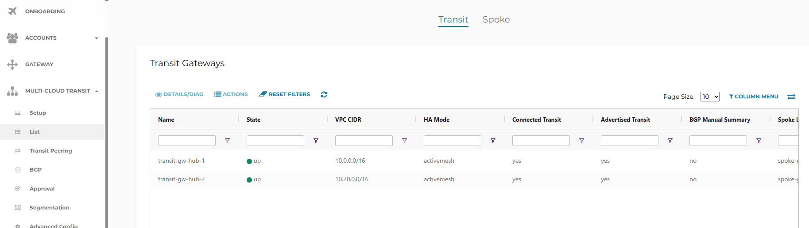
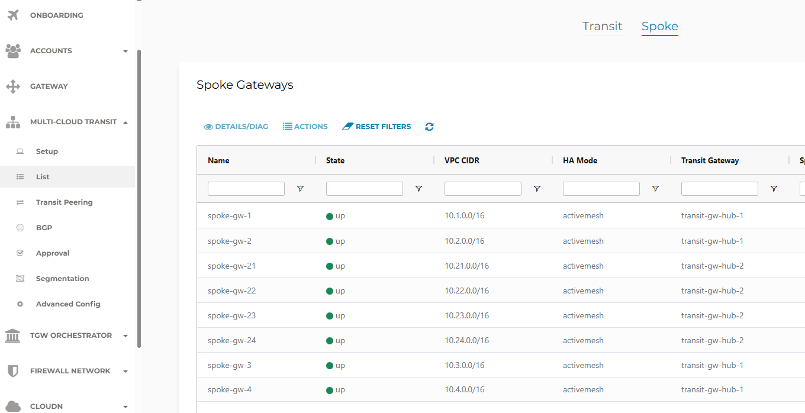
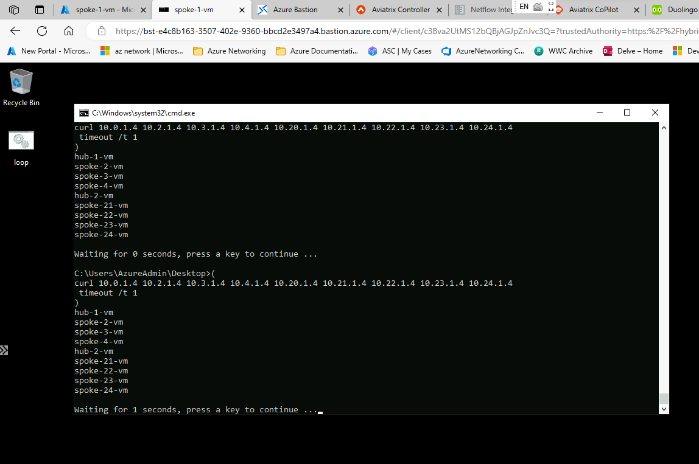
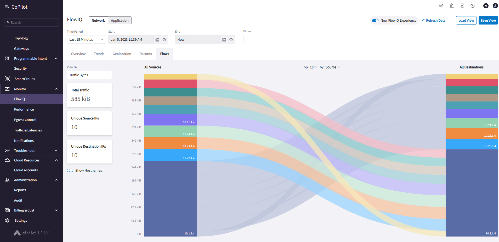

# Aviatrix Lab

This is a lab environment to explore Aviatrix on Azure. 
It is deployed through Terraform consists of three parts:
- Controller VNET with Controller and Copilot VMs.
- Two Hub VNETs and eight Spoke VNETs, each with a Windows 2022 Server VM running a basic web server. Bastion is deployed in each Hub and in Spokes 1 and 24.
- Aviatrix Transit and Spoke Gateways in each of the VNETs. Spoke Gateways 1-4 are attached to Transit Gateway 1 and Spokes 21 - 24 to Transit Gateway 2. The Transit Gateways are connected.


## Deployment
Log in to Azure Cloud Shell at https://shell.azure.com/ and select Bash.

Ensure Azure CLI and extensions are up to date:
```
az upgrade --yes
```
  
If necessary select your target subscription:
```
az account set --subscription <Name or ID of subscription>
```
  
Clone the  GitHub repository:
```
git clone https://github.com/mddazure/aviatrix-lab
```

### Controller and CoPilot
First deploy Controller and CoPilot. These are placed in a separate isolated VNET.
Change directory:
 ```
cd aviatrix-lab/controller
```

Open variables.tf in the vi editor:
```
vi variables.tf
```

Change the variable "incoming_ssl_cidr" to the public ip address the machine you will be accessing the controller with. Save and quit vi with `:wq`.

Initialize Terraform:

```
terraform init
```

Apply:
```
terraform apply
```

After deployment, copy the Controller public and private ip addresses and the CoPilot public ip address from the Terraform output.

Access the Controller from a browser on https://[controller-public-ip].

Username: admin

Password: [controller private ip address]

Follow instructions in [Azure Account Credential Setup](https://read.docs.aviatrix.com/HowTos/Aviatrix_Account_Azure.html) to create a Service Principal and configure the Controller.

### Lab
When the Controller is configured, you are ready to deploy the Lab.

Change directory:
```
cd ../lab
```

Initialize Terraform:
```
terraform init
```

Apply:
```
terraform apply
```

The lab deployment does this:
-  Create 2 Hub- and 8 Spoke VNETs, each with a Windows Server 2022 VM running a simple web server. This returns the VM machine name when accessed over http at its private ip address (e.g. `curl 10.1.1.4` to Spoke 1 returns "spoke-1-vm").
-  Configure the Aviatrix Terraform resource provider with the public ip address of the controller.
-  Create an Aviatrix Transit Gateway in each Hub VNET.
-  Create an Aviatrix Spoke Gateway is each Spoke VNET.
-  Connect:
   -  Spokes 1 - 4 to Hub 1.
   -  Spokes 21 - 24 to Hub 2.
   -  Hub 1 and Hub 2.
-  Segmentation:
   -  Create Network Domains Red, Blue and Green.
   -  Attach Spokes to Domains, see topology diagram.
   -  Create Domain Connection Policies permitting any-to-any connectivity.

## Explore

On the Controller, go to Multi-Cloud Transit -> List. 

The Transit- and Spoke Gateways will be listed, under Transit resp. Spoke at the top of the screen. 



The Spokes will show connected to their respective Transit Gateways.



Connect to Spoke VM 1 via Bastion.

Username: 
```
AzureAdmin
```

Password: 
```
Aviatrix-2024
```


Verify connectivity to all other Hub- and Spoke VMs through

`curl [ip-address]` 

This should return the VM name.

Download and run [loop.bat](https://raw.githubusercontent.com/mddazure/aviatrix-lab/main/lab/loop.bat) on Spoke VM 1 to continuously `curl` the other spokes. This creates flows that can be monitored in CoPilot.
From a command prompt, run this Powershell command:
```
powershell -ExecutionPolicy Unrestricted Invoke-WebRequest -Uri https://raw.githubusercontent.com/mddazure/aviatrix-lab/main/lab/loop.bat -OutFile 'C:\\Users\\AzureAdmin\\Desktop\\loop.bat'
```





Modify Network Domain Connection Policies under Segmentation on the Controller.

Observe connections from Spoke VM 1 failing and succeeding accordingly.

## Notes

:point_right: This lab requires an Aviatrix Customer ID.

:point_right: When deploying in a Microsoft AIRS internal subscription, NSGs are automatically attached to all subnets by policy. These NSGs block operation of the Aviatrix solution. Run the `nsg.sh` script from Cloud Shell, to periodically remove any NSGs attched by policy.
This does not create exposure as Aviatrix attaches appropriate NSG's to all their components at the NIC level, and the test VMs in the lab do not have public IP addresses.

:point_right: To use CoPilot, configure Netflow export to the public IP address of the CoPilot VM on port 31283, as documented in [Netflow Integration](https://read.docs.aviatrix.com/HowTos/netflow.html).


